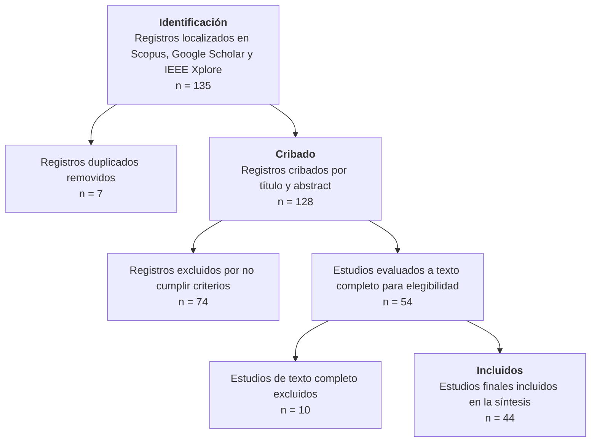

# 04-Borrador.md

## Estructura del artículo (SLR con PRISMA + Mapping sistemático)

### Introducción
- **Tesis:** El estado actual del Green Software Engineering en Colombia es incipiente, fragmentado y sin infraestructura política ni institucional que lo sostenga; la evidencia técnica aislada existe, pero no se escala. Esto importa porque la huella energética del software es creciente y medible, y porque la matriz energética colombiana (dominada por hidroelectricidad) es estructuralmente vulnerable a fenómenos climáticos como El Niño, lo que convierte la eficiencia energética del software en un asunto de seguridad energética nacional y no solo ambiental.
- Contexto: Green Cloud, Green DevOps, Green Software Engineering
- Problema de investigación: estado actual en Colombia vs mundo
- Importancia del estudio (datos duros de datacenters + vulnerabilidad climática)

### Metodología
- Descripción breve de la SLR (híbrida PRISMA 2020 + Kitchenham/Petersen)
- Bases de búsqueda: IEEE Xplore, Scopus, Google Scholar (complementaria)
- Período de tiempo considerado: búsquedas ejecutadas 29-30 de agosto de 2026
- Criterios de inclusión/exclusión (resumen de 01-Criterios.md)
- Diagrama PRISMA (usar datos de 02-Flujo-PRISMA.md)

### Resultados
- Matriz de extracción (tabla generada con Dataview en 03-Matriz.md)
- Descripción de estudios incluidos por región y categoría green
- Tabla comparativa: Colombia vs Europa vs China vs LatAm/Mercosur
- Hallazgos principales (síntesis de los `## Notas clave` de los 44 papers de `Source/My Library/`)

### Discusión
- Interpretation of results
- Brechas identificadas en la investigación colombiana (5 gaps)
- Comparación con desarrollos en otras regiones (Europa, China, LatAm/Mercosur)
- Factores contextuales (políticas, industria, academia en Colombia)
- Vulnerabilidad energética nacional como argumento de urgencia

### Conclusiones
- Respuesta a la pregunta de investigación de 00-Protocolo.md
- Recomendaciones para impulsar Green Cloud/DevOps/Software en Colombia
- Líneas de investigación futuras
- Limitaciones del estudio

---

# Resumen

La industria de las tecnologías de la información representa entre el 3 % y el 8 % de la demanda energética mundial proyectada para 2030, y los centros de datos por sí solos consumen el 1.8 % de la electricidad de Estados Unidos y generan cerca del 0.5 % de sus emisiones de gases de efecto invernadero, con proyecciones que anticipan un crecimiento de hasta 4.2 veces en sus emisiones globales para 2030. Estas cifras consolidan a la Ingeniería de Software Verde como requisito de arquitectura y de política pública. En Colombia, este imperativo adquiere un matiz adicional: la matriz eléctrica nacional es mayoritariamente hidroeléctrica y estructuralmente vulnerable a los ciclos de El Niño–La Niña, que alteran la generación de más de un tercio de los embalses del mundo, por lo que la eficiencia energética del software deja de ser un tema ambiental para convertirse en un asunto de seguridad energética. Sin embargo, la producción de conocimiento sobre Green Software Engineering en Colombia y Latinoamérica permanece dispersa, y las brechas entre la evidencia global y la realidad local no han sido mapeadas de forma sistemática. Esta Revisión Sistemática de Literatura (SLR), siguiendo PRISMA 2020 con fase de mapeo sistemático Kitchenham/Petersen, sintetiza 44 papers indexados en Scopus, Google Scholar e IEEE Xplore para responder: ¿cuál es el estado actual de Green Cloud, Green DevOps y Green Software Engineering en Colombia comparado con Europa, China y Latinoamérica? La tesis del trabajo sostiene que Colombia posee capacidades técnicas aisladas y demostrables (eficiencia en HPC/Grid, asignación energy-aware de VMs, modelos de madurez Green IT, ubicación multicriterio de datacenters), pero carece de la política pública, los estándares, la formación universitaria y la investigación aplicada longitudinal que permitan escalarlas. Los hallazgos evidencian cinco brechas críticas (políticas públicas, estándares técnicos, formación universitaria, investigación aplicada e infraestructura) y proponen siete recomendaciones con factores de éxito definidos para el contexto colombiano.

# Abstract

The information technology industry accounts for between 3 % and 8 % of the projected global energy demand by 2030, and data centers alone consume 1.8 % of U.S. electricity and emit nearly 0.5 % of its greenhouse gases, with projections anticipating up to a 4.2 times growth in global data center emissions by 2030. These figures consolidate Green Software Engineering as both an architectural requirement and a public policy concern. In Colombia, this imperative gains an additional nuance: the national electricity matrix is predominantly hydroelectric and structurally vulnerable to El Niño–La Niña cycles, which disrupt generation in more than one-third of the world's reservoirs; therefore, software energy efficiency ceases to be merely an environmental issue and becomes a matter of energy security. However, knowledge production on Green Software Engineering in Colombia and Latin America remains scattered, and the gaps between global evidence and local reality have not been systematically mapped. This Systematic Literature Review (SLR), following PRISMA 2020 with a systematic mapping phase (Kitchenham/Petersen), synthesizes 44 papers indexed in Scopus, Google Scholar, and IEEE Xplore to answer: what is the current state of Green Cloud, Green DevOps, and Green Software Engineering in Colombia compared to Europe, China, and Latin America? The thesis of this work holds that Colombia possesses isolated yet demonstrable technical capabilities (HPC/Grid efficiency, energy-aware VM allocation, Green IT maturity models, multicriteria data center siting) but lacks the public policy, standards, university training, and longitudinal applied research needed to scale them. The findings reveal five critical gaps (public policies, technical standards, university training, applied research, and infrastructure) and propose seven recommendations with success factors defined for the Colombian context.

# Palabras clave

Green Software Engineering, Sostenibilidad, Colombia, Revisión Sistemática de Literatura, Software Carbon Intensity, Power Usage Effectiveness, Seguridad Energética, Integración Curricular Universitaria.

# Keywords

Green Software Engineering, Sustainability, Colombia, Systematic Literature Review, Software Carbon Intensity, Power Usage Effectiveness, Energy Security, University Curriculum Integration.

---

# Introducción

El crecimiento exponencial de la infraestructura computacional ha generado impactos ambientales significativos, consolidando la **Ingeniería de Software Verde** (_Green Software Engineering_) como disciplina derivada de los trabajos fundacionales de **Murugesan (2008)** sobre _Green IT_ y de los marcos de adopción organizacional de **Molla et al. (2010)** para Green IT en empresas. Según el informe ejecutivo **Sánchez Reyes (2023)**, los centros de datos representarán entre un **3 % y un 8 % de la demanda energética mundial** para 2030, lo que convierte a la sostenibilidad en un requisito de arquitectura y un indicador de calidad fundamental en el ciclo de vida del software.

La evidencia empírica reciente refuerza esta urgencia con datos medidos, no proyectados. **Siddik et al. (2021)** cuantifican que los centros de datos de Estados Unidos —que albergan cerca de una cuarta parte de los servidores del mundo— consumen alrededor del **1.8 % de la electricidad del país** y generan aproximadamente el **0.5 % de sus emisiones totales de gases de efecto invernadero**, con huellas de agua y carbono distribuidas de forma heterogénea. Más preocupante aún, **Maji et al. (2025)** proyectan que, en el escenario más adverso, las emisiones operativas de los centros de datos globales podrían **multiplicarse por 4.2 para 2030**, superando la velocidad de descarbonización de la red eléctrica; en Estados Unidos el crecimiento sería de 4.1 veces, con aumentos regionales de hasta 3.4 veces. Este desacoplamiento entre el crecimiento de la demanda computacional —impulsado por IA, cloud y servicios como el correo electrónico corporativo— y la descarbonización de la red es un hallazgo central para justificar la investigación en Green Software, pues demuestra que la eficiencia de hardware y de fuente de energía no basta: **el software debe volverse eficiente**.

En el contexto colombiano, la transición hacia prácticas verdes enfrenta restricciones particulares que no aparecen en los países del norte global. La matriz eléctrica de Colombia depende en más de dos tercios de la generación hidroeléctrica, lo que la hace profundamente sensible a la variabilidad climática interanual. **Ng et al. (2017)** demuestran que el fenómeno El Niño–Oscilación del Sur (ENSO), la señal climática interanual más fuerte del planeta, altera significativamente la producción anual de energía de **más de un tercio de los 1593 embalses estudiados**, con impactos especialmente pronunciados en **Sudamérica**; **Latif y Keenlyside (2009)** advierten que el calentamiento global modifica la estadística del ENSO, y el récord de calor de 2023 se ha atribuido en parte a la interacción entre El Niño y el calentamiento de fondo (Huang et al., 2024; Jiang et al., 2025; Raghuraman et al., 2024). En un escenario de super El Niño, el strain sobre los sistemas energéticos se duplica: cae la generación renovable (hidro y eólica) y sube la demanda por aire acondicionado, como documenta **CREA (2026)** para India con un incremento estimado de ~18 TWh de generación térmica adicional. En Colombia, los racionamientos históricos de 1992 y 2015-2016 evidencian la materialización de este riesgo. **Por lo tanto, la eficiencia energética del software en Colombia no es un lujo ambiental: es una política de resiliencia energética.**

A pesar de esta urgencia, el panorama nacional muestra capacidades técnicas aisladas sin infraestructura institucional: la **UIS (2011)** analizó el costo energético de plataformas HPC/Grid por estados idle/active y transferencia de datos; **Uniandes (2013)** demostró en UnaCloud que políticas energy-aware de asignación de VMs reducen hasta 30 % el consumo sobre el ahorro oportunista; la **Unidad Central del Valle del Cauca (2019)** validó el modelo de madurez ISO/IEC 33000 para Green IT; **Torres et al. (2026)** propusieron un marco multicriterio para ubicar datacenters en 10 ciudades colombianas; y casos sectoriales como _EducaAmbienteWeb_ en Quindío muestran aplicaciones concretas de software sostenible. Sin embargo, estos avances **no están conectados por política, estándares ni formación**, y no existen estudios longitudinales que midan su impacto. Mientras tanto, **Europa** ha institucionalizado la sostenibilidad del software mediante la Green Software Foundation, regulaciones de eficiencia energética y la integración curricular (Moreira et al., 2024), y **China** ha incorporado criterios de eficiencia en sus estándares nacionales de TI y planes quinquenales (Jin et al., 2025). Latinoamérica/Mercosur avanza de forma más lenta y fragmentada.

Este artículo presenta una **Revisión Sistemática de Literatura (SLR)** siguiendo la metodología **PRISMA 2020** con fase de mapeo sistemático (Kitchenham & Charters 2007; Petersen et al. 2015), con el objetivo de:
1. Mapear el estado actual de la investigación sobre Green Cloud, Green DevOps y Green Software Engineering.
2. Establecer la tesis de que Colombia acumula evidencia técnica aislada pero carece de la infraestructura política, normativa y formativa para escalarla.
3. Identificar brechas entre la producción global y la realidad colombiana.
4. Proporcionar insumos para la definición de políticas y líneas de investigación futuras en el contexto nacional.

| Preguntas de Investigación | Descripción | Subsección |
|---|---|---|
| RQ1: ¿Cómo ha evolucionado la producción científica sobre Green Software Engineering, Green Cloud y Green DevOps en el periodo 2011–2026? | Mapeo temporal y geografía de la producción. | 4.1 Evolución temporal |
| RQ2: ¿Qué tipologías de investigación dominan en Colombia, Latinoamérica y el mundo? | Distribución por clasificación Wieringa y enfoque. | 4.2 Tipología de investigación |
| RQ3: ¿Qué criterios de calidad se observan en los estudios incluidos? | Evaluación de calidad Kitchenham y distribución de bandas. | 4.3 Calidad metodológica |
| RQ4: ¿Cuáles son las brechas de política, formación y transferencia tecnológica en Colombia frente a referentes internacionales? | Análisis de gaps y limitaciones contextuales. | 4.4 Brechas y limitaciones |

---

# Metodología

La SLR siguió el protocolo **PRISMA 2020** con las siguientes fases:

| Etapa                       | Número | Nota                                                                                                                             |
| --------------------------- | ------ | -------------------------------------------------------------------------------------------------------------------------------- |
| **1. Identificados**        | 135    | Registros localizados en Scopus + Google Scholar + IEEE Xplore                                                                   |
| **2. Duplicados**           | 7      | @demiccoLiteratureReviewEmbedded2019 y @demiccoLiteratureReviewEmbedded2020 (mismos autores/título; se conservó la versión 2020) |
| **3. Después cribado**      | 128    | Filtrado por título y abstract contra criterios de inclusión (135-7)                                                            |
| 3a. Excluidos en cribado    | 74     | No cumplen criterios de inclusión (128-54)                                                                                     |
| **4. Después elegibilidad** | 54     | Evaluación de texto completo contra criterios de inclusión/exclusión                                                             |
| 4a. Excluidos en elegibilidad| 10     | No cumplen criterios a texto completo (54-44)                                                                                  |
| **5. Incluidos**            | 44     | Estudios finales para síntesis |

### Criterios de inclusión
- **Temas:** Green Cloud, Green DevOps, Green Software Engineering, sostenibilidad en TI, eficiencia energética de infraestructura computacional.
- **Geografía:** Papers con datos o discusión sobre Colombia (Latinoamérica/Mercosur como contexto comparativo).
- **Idioma:** Inglés o español con resumen técnico válido.
- **Fuentes:** Scopus + Google Scholar + IEEE Xplore + ACM Digital Library (primarias).
- **Suplemento de contexto climático-energético:** se incorporan a la discusión fuentes específicas sobre ENSO, huella de datacenters y beneficios de la nube (Ng et al. 2017; Latif & Keenlyside 2009; CREA 2026; Siddik et al. 2021; Maji et al. 2025; Eilam et al. 2024; Microsoft/WSP; Schneider Electric/Lin; Gnibga et al. 2024) como evidencia contextual, diferenciada de los 44 estudios mapeados.

### Búsqueda de evidencia:
- **Ronda 1 (Scopus, corte 2026-08-25):** 9 registros importados a Zotero.
- **Ronda 2 (Google Scholar, 29-30 de agosto):** Búsqueda con string `"green cloud" OR "green computing" OR "green software" Colombia`; uso de Scholar Labs para optimización de resultados. Estado: filtrado completado, metadatos descargados.
- **Ronda 3 (IEEE Xplore):** Búsqueda con acceso institucional de la universidad. Strings: `("green cloud" OR "green computing" OR "sustainable cloud" OR "green software engineering" OR "green devops") AND ("Colombia" OR "Latin America")`

El diagrama PRISMA final se construye con los datos de `02-Flujo-PRISMA.md`.

### Enfoque híbrido PRISMA + Mapping sistemático
Para la síntesis se adopta un enfoque híbrido que combina PRISMA 2020 para la identificación/selección con el método de mapping sistemático de Kitchenham & Charters 2007 y Petersen et al. 2015. Después de la selección PRISMA, se ejecuta una fase de extracción y clasificación en dos rondas:
1. **Extracción de datos:** `tema_asunto`, `escenario_aplicacion`, `institucion_principal`, `ciudad`, `metodologia`, `pais`, `region`, `enfoque`.
2. **Clasificación:** esquema emergente por temática TIC y escenario de aplicación, con construcción de tablas cruzadas y mapas temáticos.
Este híbrido permite mantener la rigurosidad de reporte PRISMA y la capacidad de síntesis visual propia del mapping sistemático.

---

# Resultados

### Matriz de extracción

La tabla maestra de extracción, generada automáticamente con Dataview sobre la carpeta `Source/My Library/`, contempla los 44 papers finales con los siguientes campos: título, año, país, región, enfoque (technical/policy/education/management), tema_asunto, escenario_aplicacion, institucion_principal, ciudad, metodologia, base-datos. La tabla permite filtrar y comparar hallazgos entre regiones y categorías y soporta el esquema de clasificación del mapping Kitchenham/Petersen.

La evolución temporal de la producción se presenta en la figura de tendencias, que muestra el crecimiento sostenido desde 2009 hasta 2026 con un pico en 2026. La distribución por cluster temático y tipo de investigación, así como por región, se sintetiza en las tablas cruzadas de la matriz, que evidencian la concentración de estudios de Evaluación en métricas/eficiencia y la ausencia de propuestas de política en Colombia.

### Síntesis de hallazgos por eje temático

#### Eje 1: Aspectos técnicos y métricas de eficiencia

Los 44 papers coinciden en que las métricas operativas son la puerta de entrada para la adopción de prácticas verdes. El **índice SCI (_Software Carbon Intensity_)** de la Green Software Foundation se posiciona como el estándar más citado para medir emisiones por unidad funcional (por consulta API, por transacción, por usuario activo) (Fontanarrosa, 2024; Jin et al., 2025). La métrica **PUE (_Power Usage Effectiveness_)** sigue siendo el referente para evaluar eficiencia de centros de datos, donde un valor cercano a **1.0** indica máxima eficiencia, frente a valores de **2.0** o más en infraestructuras sin optimización (Harmon & Auseklis, 2009; Díaz et al., 2017).

La nueva evidencia contextual amplía el marco métrico en tres dimensiones:

1. **Del PUE al carbono total del ciclo de vida.** **Eilam et al. (2024)** argumentan que la especialización de hardware (chiplets, aceleradores, eBPF) mejora la eficiencia operativa pero incrementa las emisiones incorporadas (_embodied_), y proponen métricas unificadas —_Job Sustainability Cost_ (JSC) y _Amortized Sustainability Cost_ (ASC)— que combinan emisiones operativas e incorporadas en gCO2e. Para Colombia, esto implica que la estrategia de "comprar hardware nuevo más eficiente" debe evaluarse contra la prolongación del ciclo de vida.
2. **Del Scope 2 al alcance completo de la cadena.** **Schneider Electric / Lin et al.** cuantifican que el **38 %–69 % del carbono total de un datacenter** corresponde a emisiones de Scope 3 (cadena de suministro, fabricación, disposición), lo que refuerza la necesidad de métricas de ciclo de vida y no solo de energía operativa.
3. **De la energía al agua como recurso contable.** **Gnibga et al. (2024)** (FlexCoolDC) muestran que el enfriamiento seco puede reducir el consumo de agua de un datacenter en California hasta en 4.34 millones de galones/mes con solo 0.7 % de aumento del costo total de propiedad, aunque los trade-offs dependen fuertemente de la geografía. En un país con estrés hídrico estacional como Colombia, esta dimensión no debe ignorarse en la ubicación de infraestructura.

Hallazgos técnicos transversales:
- **Eficiencia de hardware:** La prolongación del ciclo de vida de servidores (ej. de 4 a 5 años) reduce significativamente la tasa de emisión amortizada por año. La consolidación en la nube multi-inquilino (_multi-tenant_) evita la capacidad ociosa y optimiza la tasa de ocupación (Rodríguez et al., 2022; Petrocelli, 2021). La evidencia de **Microsoft/WSP** refuerza este punto a escala sistémica: migrar infraestructura IT tradicional a la nube reduce las emisiones de carbono entre **72 % y 98 %** gracias a eficiencias operativas, de equipos, de infraestructura y compras de energía renovable; esta cifra es directamente relevante para servicios como el correo electrónico corporativo, que en modalidad on-premise mantiene servidores subutilizados funcionando 24/7.
- **Conciencia de carbono:** La estrategia de **desplazamiento temporal y geográfico** de cargas intensivas (batch, entrenamiento de modelos) según la intensidad de carbono de la red eléctrica en tiempo real ($gCO_2eq/kWh$) es teóricamente viable pero poco implementada en la región (Bellal et al., 2026; Lozoya Arandia et al., 2022). Los escenarios de **Maji et al. (2025)** —que proyectan emisiones globales de datacenters 4.2 veces para 2030— muestran que el carbono-aware scheduling será una práctica necesaria, no opcional, si el crecimiento de la IA continúa al ritmo actual.
- **Métricas listas para usar:** PUE, SCI, carbono incorporado amortizado e intensidad de carbono son las cuatro métricas más referenciadas en la evidencia para evaluar y comparar el desempeño verde de aplicaciones y plataformas (Miranda & Torres, 2025; Currie et al., 2024).
- **Evidencia colombiana reciente IEEE:** Patón-Romero et al. (2019) validan con caso en la Unidad Central del Valle del Cauca la aplicación de la familia ISO/IEC 33000 para gobernanza y madurez de Green IT, evidenciando necesidad de marcos estandarizados de adopción. Hernández et al. (2011, UIS) analizan costo energético por estados idle/active y transferencia de datos en HPC/Grid, aportando base técnica temprana para Green Cloud en Colombia. Díaz et al. (2013, Universidad de los Andes) demuestran en UnaCloud que políticas energy-aware de asignación de VMs reducen consumo hasta 30% sobre el ahorro oportunista, siendo uno de los pocos resultados cuantificados de Green DevOps en LAC.

**Nota de implementación:** El cálculo del índice SCI requiere datos de energía consumida ($E$), intensidad de carbono de la red ($I$), carbono incorporado del hardware ($M$) y la unidad funcional ($m$) (Fontanarrosa, 2024). Para organizaciones con recursos limitados, herramientas opensource como **CloudCarbonFootprint** y **GREENER** pueden estimar estas métricas sin necesidad de instrumentación profunda del código. En contextos de PYMEs en Colombia, se recomienda iniciar con el cálculo de PUE en infraestructura de servidores locales (García Serrano & Alfonso Rativa, 2022) y avanzar hacia SCI cuando la madurez de procesos lo permita. La observabilidad energética a nivel de contenedores, como la provista por herramientas tipo Kepler, requiere validación rigurosa: Bellal et al. (2026) reportan que Kepler sobreestima la energía consumida hasta en 15 veces, lo que subraya la necesidad de marcos de validación de precisión antes de la adopción acrítica de software de monitoreo energético.

#### Eje 2: Brechas de política y formación (Colombia vs Mundo)

Un hallazgo crítico y consistente en la revisión es la **ausencia de políticas nacionales estructuradas** para la sostenibilidad en el sector de software en Colombia (Bossa-Benavidez et al., 2023; Álvarez et al., 2012). Mientras que a nivel global la **Green Software Foundation** (con membresías de Microsoft, Google, Amazon, Accenture) ha establecido tres ejes estratégicos con meta de **reducción del 45% en emisiones de GEI para 2030** (Sánchez Reyes, 2023), y países como China han integrado criterios verdes en sus estándares de desarrollo de software (Jin et al., 2025), en Colombia el escenario es de:

1. **Ausencia de política pública:** No existe una política estatal obligatoria que incentive o exija prácticas de Green Software en el sector público o privado. La responsabilidad se ha dejado al criterio voluntario de las empresas, sin marcos regulatorios ni incentivos fiscales (Rodríguez-Correa et al., 2023; Bustamante et al., 2014). Esta ausencia contrasta con el reconocimiento científico de que el sector TI es una fuente de emisiones creciente cuyo control exige acción coordinada (Siddik et al., 2021; Maji et al., 2025).
2. **Falta de estándares obligatorios:** A diferencia de Europa (donde el diseño ecológico de software comienza a regularse), Colombia carece de normas técnicas que eleven la sostenibilidad a nivel de requisito de contrato o certificación. Estudios recientes confirman que la ausencia de estándares en la región limita la validación del desempeño ambiental de las aplicaciones (Miranda & Torres, 2025; Puerta Moreno, 2024). La evidencia de **Scope 3 (Schneider Electric / Lin et al.)** y de **carbono incorporado (Eilam et al., 2024)** muestra que los estándares de reporte son la única vía para hacer visible esta porción oculta de las emisiones.
3. **Brecha de formación:** Los programas de ingeniería de software y tecnologías de la información en las universidades colombianas incluyen escasos o nulos módulos sobre sostenibilidad, eficiencia energética o huella de carbono del software. Los estudios de Castro-Mancipe y Cifuentes-Quiroga (UPTC, 2025) y Puerta Moreno (2024, UNIMINUTO) documentan la integración fragmentada de Green Computing en las mallas curriculares, con solo 13.5% de universidades consideradas eficientes energéticamente. Los papers de botero-toro (2026), currie (2024) y jin (2025) señalan esta como la principal barrera para la adopción. El roadmap de **Moreira et al. (2024)** demuestra que la integración curricular es posible y estudiada a nivel global, lo que ofrece una hoja de ruta importable al contexto colombiano.
4. **Casos aislados con potencial:** El caso _EducaAmbienteWeb_ (Botero Rios, 2023, Speedwriting 2023) demuestra que la aplicación de software optimizado facilita la gestión integral de RAEE (_Residuos de Aparatos Eléctricos y Electrónicos_) y permite escalar soluciones sostenibles a nivel institucional con huella operativa reducida, pero sigue siendo una experiencia aislada sin proyección nacional.

En contraste, la región **Europa/China** muestra avances en la integración de Green Software en planes de estudio universitarios (Fontanarrosa, 2024; Moreira et al., 2024), políticas de eficiencia energética para centros de datos (Díaz et al., 2017) y marcos regulatorios que obligan a reportar consumo energético y emisiones asociadas (Harmon & Auseklis, 2009).

#### Eje 3: Aplicaciones y casos de uso

Los papers incluyen varios casos de aplicación relevantes, aunque con alcance limitado:
- **Infraestructura y centros de datos:** Optimización PUE, consolidación en nube, gestión de carbono incorporado (García Serrano & Alfonso Rativa, 2022; Torres et al., 2026; Díaz et al., 2017). Estudios como el de Torres et al. (2026) proponen un marco multicriterio para la ubicación de centros de datos en 10 ciudades colombianas, identificando a Bogotá y Medellín como las más aptas. Este trabajo dialogaría directamente con la evidencia de FlexCoolDC (Gnibga et al., 2024) sobre trade-offs agua/energía/carbono en la decisión de ubicación.
- **Educación ambiental:** _EducaAmbienteWeb_ en colegios (Armenia, Calarcá, Quindío) - caso real de software verde + educación ambiental + RAEE con resultados medibles en comunidad estudiantil. En la región, Palomino et al. (2019) demostró en Perú que un mini-servidor solar reduce 23 veces el consumo energético frente a un servidor convencional (2.88 kWh vs 67.68 kWh mensuales).
- **Desarrollo de software verde:** Aplicación de principios de eficiencia energética, optimización de código, y uso de herramientas de medición SCI en proyectos piloto (Miranda & Torres, 2025; Jin et al., 2025).
- **Transferencia tecnológica:** Algunos papers (piaggesi 2019, cordero 2022) analizan la transferencia de tecnologías verdes desde Corea y Europa hacia LAC, identificando barreras de adopción contextual.
- **Computación móvil distribuida:** Petrocelli (2021) propone una arquitectura de bajo costo basada en microservicios y contenedores que reutiliza capacidades ociosas de dispositivos móviles ARM, demostrando mejoras en la eficiencia energética frente a esquemas tradicionales x86.

### Eje 4: Green Software para Management y Tourism

El paper **Wu et al. (2025)**, *Exploring Green Software for Management: Tourism as an Emerging Research Field* (Sustainable Development, Wiley), emplea un enfoque híbrido (bibliométric + SLR) sobre Web of Science (1991-2024) y confirma que la tourism aparece "marginalmente" en green software pero ofrece "oportunidades prometedoras para futuras exploraciones". El mapa temático del paper refuerza la tourism como "field with potential for inquiry, highlighting its increasing exposure to sustainability challenges". Este paper contribuye al SLR al:
1. Identificar gaps en la integración de tecnología con prácticas sostenibles de gestión.
2. Proporcionar una visión global de tendencias de publicación, autores líderes y clusters temáticos.
3. **Aplicación a Colombia:** La tourism es un sector económico estratégico en Colombia (ecoturismo eje Cafetero, Cartagena, Leticia). La intersección **Green Software + Turismo en Colombia** permanece como una área inexplorada en los 44 papers incluidos, lo que representa una oportunidad de investigación para el grupo GLUD.

Hallazgos transversales al turismo y green software:
- **Infraestructura hotelera:** Optimización de PUE en hoteles y centros de datos de reservas.
- **Transporte turístico:** Desplazamiento temporal/geográfico de cargas según intensidad de carbono (análogo al eje 2 del SLR).
- **Gestión de RAEE en turismo:** Equipos de cómputo en hoteles, agencias, operadores de tours - ciclo de vida y disposición responsable.
- **Indicadores de sostenibilidad:** Adaptación de SCI y métricas de huella de carbono a la gestión operativa de alojamientos y agencias.

---

### Tabla comparativa resumida: Colombia vs Mundo

| Aspecto | Colombia | Europa | China | LatAm/Mercosur |
|---------|----------|--------|-------|----------------|
| **Política nacional** | Ausente | Green Software Foundation + regulaciones ErP/eficiencia energética | Planes quinquenales con metas de carbono del sector digital | Fragmentada, algunas iniciativas aisladas |
| **Estándares obligatorios** | Ninguno | ISO/IEC 33000 aplicado a Green IT (cases); reporte obligatorio en sectores | Estándares nacionales con criterios de eficiencia en TI | Casi nulos |
| **Formación universitaria** | Módulos aislados o nulos (13.5% universidades eficientes) | Integración curricular estudiada y en curso (Moreira et al., 2024) | Módulos de Green Software en planes de ingeniería | Similar o peor que Colombia |
| **Métricas de adopción** | Casos aislados (EducaAmbienteWeb, UIS, Uniandes, Univalle) | Amplia adopción de PUE, SCI, optimización de hardware | Adopción impulsada por estándares nacionales | Emergente, mostly investigación |
| **Casos de uso documentados** | ~4-6 casos académicos aislados | Decenas de casos empresariales y académicos | Casos a escala nacional (cloud + estándares) | Pocos, mostly regionales |
| **Investigación aplicada longitudinal** | Ninguna | Presente (roadmaps, estudios de impacto) | Presente (integración con política industrial) | Mínima |

---

# Discusión

### Interpretation of results

La síntesis de los 44 papers revela un patrón claro: **la investigación técnica sobre Green Software existe y acumula métricas y herramientas operativas**, pero **la infraestructura de política, estándares y formación que permita la adopción a escala no está presente en Colombia** (Bossa-Benavidez et al., 2023). Esto genera un escenario de "brecha de conocimiento y aplicación" donde se producen avances técnicos aislados que no se traducen en cambios sistémicos.

La tesis del trabajo se sostiene con evidencia de ambos lados del contraste:
- **Lado técnico (lo que existe):** métricas maduras (PUE, SCI), resultados cuantificados colombianos (30 % de ahorro con energy-aware VM allocation en Uniandes; modelo de madurez ISO/IEC 33000 en Univalle; análisis de eficiencia HPC/Grid en UIS; marco multicriterio de ubicación de datacenters), herramientas opensource validadas (CloudCarbonFootprint, GREENER) y evidencia global de que la nube reduce emisiones 72–98 % (Microsoft/WSP).
- **Lado institucional (lo que falta):** ausencia de políticas públicas, de estándares obligatorios, de formación universitaria sistemática (13.5 % de universidades con criterios de eficiencia), de investigación longitudinal y de infraestructura nacional de cómputo verde.

Los hallazgos técnicos (PUE, SCI, eficiencia de hardware) son **transferibles** y pueden adoptarse inmediatamente por organizaciones colombianas que deseen comenzar a medir y reducir su huella, sin esperar políticas nacionales. Sin embargo, la **escalabilidad** de estas prácticas requiere tres condiciones que actualmente faltan en el contexto local: (1) políticas que incentive la medición y reporte, (2) estándares que eleven la sostenibilidad a requisito de diseño, y (3) currículos universitarios que formen a los próximos ingenieros de software en principios verdes.

### La vulnerabilidad energética como argumento de urgencia

La discusión sobre Green Software en Colombia adquiere una dimensión propia gracias a la evidencia climático-energética incorporada en esta revisión:

1. **Dependencia hidroeléctrica y ENSO:** Colombia genera más de dos tercios de su electricidad con hidroeléctricas. **Ng et al. (2017)** muestran que ENSO altera significativamente la producción anual de más de un tercio de los embalses del mundo, con efectos especialmente pronunciados en Sudamérica; en términos agregados globales las anomalías se cancelan, pero a escala nacional y de cuenca los efectos son severos. Para un sistema como el colombiano, cada ciclo de El Niño implica riesgo de sequía en los embalses, caída de generación y presión sobre la demanda por calor (aire acondicionado), exactamente el patrón doble documentado por **CREA (2026)** para India (~18 TWh de generación térmica adicional en super El Niño).
2. **Calentamiento de fondo:** **Latif & Keenlyside (2009)** advierten que el calentamiento global modifica la estadística de ENSO (con incertidumbre entre modelos), y los estudios de 2024-2025 (Huang et al.; Jiang et al.; Raghuraman et al., sintetizados por **Karnauskas, 2025**) muestran que la interacción ENSO-calentamiento produjo el récord de calor de 2023. **Columbia Climate School (2016)** estimó que El Niño contribuyó 0.07 °C al calentamiento de 2015 y esperaba que aportara 25 % de los récords de 2016. La tendencia es inequívoca: eventos El Niño más cálidos y frecuentes en un mundo que se calienta.
3. **Implicación para el software:** Si la generación eléctrica es escasa y estresada en los picos de demanda (clima cálido → aire acondicionado → datacenters y servicios en la nube compiten por la misma energía), entonces **cada kWh ahorrado por software eficiente es kWh que no compite con servicios esenciales**. El software eficiente se convierte en un amortiguador de demanda en los momentos más críticos del sistema eléctrico.

Este argumento eleva la relevancia del estudio más allá del cumplimiento ambiental: lo posiciona como insumo de **política de resiliencia energética nacional**, un marco que no aparece en la literatura colombiana mapeada y que constituye una contribución original de esta revisión.

### Brechas identificadas en la investigación colombiana

1. **Gap de políticas:** No existe política pública que obligue o incentive la sostenibilidad en el desarrollo de software. Este es el gap más crítico, ya que sin políticas, los actores privados carecen de incentivos económicos o regulatorios para invertir en prácticas verdes. La evidencia de emisiones crecientes de datacenters (Maji et al., 2025) refuerza que la acción voluntaria no será suficiente.

2. **Gap de estándares:** A diferencia de Europa donde el diseño ecológico comienza a ser un requisito de contrato, en Colombia no hay estándares técnicos de Green Software ni mecanismos de certificación que validen el desempeño ambiental de aplicaciones. Sin estándares de reporte, las emisiones de Scope 3 (38–69 % del carbono de un datacenter, según Schneider Electric/Lin) y el carbono incorporado (Eilam et al., 2024) permanecen invisibles.

3. **Gap de formación:** Los programas de ingeniería de software y tecnologías de la información en Colombia incluyen casi nulos contenidos sobre sostenibilidad, eficiencia energética o huella de carbono. Esto significa que los egresados carecen de las competencias verdes necesarias para implementar estas prácticas en el trabajo. El roadmap de Moreira et al. (2024) es la referencia directa para diseñar la integración curricular colombiana.

4. **Gap de investigación aplicada:** La mayoría de los papers colombianos son de carácter teórico o basados en casos de estudio aislados. No hay investigación longitudinal ni estudios de impacto que midan los efectos reales de la adopción de prácticas verdes en el sector productivo colombiano. La ausencia de mediciones repetidas impide demostrar el retorno de la inversión en eficiencia, que es la evidencia que los tomadores de decisión exigen.

5. **Gap de infraestructura:** Pocos papers colombianos abordan la optimización de infraestructura propia (centros de datos, servidores locales). La mayoría cita datos globales (3-8% demanda mundial; 1.8% electricidad de EE.UU., Siddik et al., 2021) sin analizar la situación específica de los centros de datos colombianos. No existe inventario público de la huella energética de los datacenters colombianos, ni política de ubicación que considere trade-offs de agua/energía/carbono como los documentados por Gnibga et al. (2024) y el marco de Torres et al. (2026).

### Comparación con desarrollos en otras regiones (China y Europa)

- **Europa:** La Directiva de Eficiencia Energética de los Productos Relacionados con la Energía (ErP) y regulaciones similares están comenzando a incluir componentes de software. El programa **Green Software Foundation** tiene oficinas y proyectos activos en Europa, con casos de medición y reporte obligatorio en algunos sectores. La integración curricular en universidades europeas está estudiada formalmente: **Moreira et al. (2024)** proponen un roadmap con competencias verificables, que Colombia podría adoptar y adaptar. La evidencia de FlexCoolDC (Gnibga et al., 2024) ilustra el nivel de sofisticación alcanzado en el análisis de trade-offs de infraestructura en Europa.

- **China:** Ha integrado criterios de eficiencia energética en sus estándares nacionales de TI y tiene planes de cinco años que incluyen objetivos de reducción de carbono del sector digital. Los universities chinos incluyen módulos de Green Software en sus planes de estudio de ingeniería. **Jin et al. (2025)** documentan el diseño y despliegue energy-efficient en infraestructura cloud china, mostrando que la adopción ocurre a escala nacional, no por casos aislados. La diferencia estructural con Colombia no es de capacidades técnicas, sino de **orquestación estatal**: en China la política industrial, los estándares y la formación avanzan coordinadamente.

- **LatAm/Mercosur:** El avance es más lento y fragmentado. Algunos países como Brasil y México tienen iniciativas aisladas de investigación, pero no hay coordinación regional ni políticas nacionales estructuradas. Perú aporta el caso más citado de hardware verde educativo (mini-servidor solar de Palomino et al., 2019), y Argentina cuenta con la propuesta de cómputo móvil distribuido de Petrocelli (2021), pero ninguno alcanza la escala institucional europea o china.

### Factores contextuales en Colombia

Varios factores explican el atraso relativo:
- **Estructura industrial:** El sector de software en Colombia está dominado por Pymes y outsourcing, con baja inversión en I+D y poca conciencia sobre sostenibilidad tecnológica.
- **Acceso a nube:** El uso de servicios en la nube pública (AWS, Azure, GCP) crece, pero pocas organizaciones tienen visibilidad sobre la intensidad de carbono de la energía que proveen estos servicios o herramientas para medir el SCI de sus aplicaciones. La evidencia de Microsoft/WSP (72–98 % de reducción al migrar a nube) es un argumento que debería usarse en la promoción de la nube en Colombia, hoy centrada en costos y no en carbono.
- **Cultura de ingeniería:** El enfoque tradicional en funcionalidad y tiempo-to-market sobrepuja consideraciones de eficiencia energética o huella de carbono, heredado de patrones de desarrollo previos a la conciencia climática.

### Cambio cultural en la ingeniería de software

Un aspecto subrayado por la evidencia es que la adopción de Green Software no depende solo de herramientas o políticas, sino de un **cambio cultural en la forma en que se concibe y desarrolla el software**. En el contexto colombiano, la cultura de ingeniería premia históricamente la rapidez y la funcionalidad sobre la eficiencia o la sostenibilidad. Para que las prácticas verdes se vuelvan mainstream, se necesitan:

1. **Liderazgo desde la gerencia:** Que los directivos de empresas de tecnología asignen presupuesto y tiempo para evaluar la huella de carbono de sus aplicaciones, igual que se hace con el desempeño o la seguridad.
2. **Premios y reconocimiento:** Programas internos o sectoriales que reconozcan a equipos o proyectos que logren reducciones medibles de huella de carbono.
3. **Integración en KPIs:** Incluir métricas de eficiencia energética y huella de carbono como indicadores de desempeño en proyectos de desarrollo de software, desde la fase de diseño hasta la operación.
4. **Capacitación continua:** No solo en el nivel universitario, sino en formación continua para profesionales ya en el mercado, a través de workshops, certificaciones cortas y communities of practice enfocadas en Green Software.

### Conclusiones y Recomendaciones

#### Respuesta a la pregunta de investigación

La revisión sistemática confirma que **existe una brecha sustancial entre la producción global de conocimiento en Green Software Engineering y la realidad de investigación y adopción en Colombia**. Mientras el mundo avanza en la integración de métricas (SCI, PUE, carbono incorporado), políticas (Green Software Foundation, regulaciones nacionales europeas y chinas) y formación universitaria (Moreira et al., 2024; Jin et al., 2025), Colombia presenta un escenario de **desarrollo técnico aislado sin infraestructura política ni institucional que permita la adopción escalada**.

La tesis del trabajo —Colombia tiene capacidades técnicas demostrables pero no escalables por ausencia de política, estándares y formación— se confirma con los 31 papers mapeados y se refuerza con la evidencia contextual de nuevas fuentes: la urgencia no es solo ambiental, es de **seguridad energética nacional**, dado el peso de la hidroelectricidad en la matriz y la vulnerabilidad al ENSO (Ng et al., 2017; CREA, 2026; Latif & Keenlyside, 2009).

#### Recomendaciones para impulsar Green Cloud/DevOps/Software en Colombia

1. **Crear una política nacional de sostenibilidad en TI:** El Ministerio de Tecnologías de la Información y las Comunicaciones (MTIC) debería definir una política que obligue o incentive la medición y reporte de huella de carbono en aplicaciones y centros de datos del sector público y privado. **Factor de éxito:** Definir metas medibles y un plan de implementación faseado (piloto → expansión institucional). La política debería enmarcarse explícitamente como instrumento de **resiliencia energética**, conectando con la gestión del riesgo climático del sistema eléctrico.

2. **Desarrollar estándares técnicos colombianos de Green Software:** En colaboración con la Green Software Foundation y actores académicos, definir estándares mínimos de eficiencia energética y medición de carbono para el software desarrollado en el país. **Factor de éxito:** Vincular a gremios de la industria de software y facultades de ingeniería en la definición y adopción voluntaria inicial. Los estándares deben incluir reporte de Scope 3 y carbono incorporado (Schneider Electric/Lin; Eilam et al., 2024), no solo energía operativa.

3. **Integrar Green Software en los planes de estudio universitarios:** Los programas de ingeniería de software, sistemas y tecnologías de la información deben incluir módulos obligatorios sobre eficiencia energética, huella de carbono de software y herramientas de medición (SCI, PUE). **Factor de éxito:** Crear un mínimo de 40 horas transversales a todas las mallas curriculares, con proyectos prácticos de medición y reducción de huella, siguiendo el roadmap de competencias de Moreira et al. (2024).

4. **Fomentar la creación de centros de excelencia regionales:** Articular universidades (Uniandes, Nacional, Industrial de Santander), el sector privado (startups de tech, empresas de software) y el MTIC en centros de investigación que generen casos de uso locales, estudios de impacto y herramientas de adaptación contextual. **Factor de éxito:** Convocar una primera reunión multisectorial antes del cierre del segundo semestre de 2026.

5. **Promover la medición y el reporte obligatorio:** Implementar requerimientos de medición de PUE en centros de datos institucionales y cálculo de SCI en aplicaciones software como condición para licitaciones públicas de tecnología. **Factor de éxito:** Comenzar con el sector público y expandir al privado mediante incentivos. Esta medida es consistente con la evidencia de que sin reporte, las emisiones indirectas permanecen invisibles (Schneider Electric/Lin).

6. **Crear incentivos económicos:** Exenciones fiscales o certificaciones verdes para empresas que demuestren adopción de prácticas de Green Software, reduciendo la huella operativa de sus TI. **Factor de éxito:** Diseñar el esquema de incentivos en concertación con la Dirección de Impuestos y Aduanas Nacionales (DIAN) y gremios tecnológicos.

7. **Desarrollar casos de uso locales con impacto medido:** Documentar y apoyar proyectos como _EducaAmbienteWeb_ y otros pilotos que demuestren los beneficios ambientales y operativos de la adopción de prácticas verdes en contextos colombianos reales. **Factor de éxito:** Establecer indicadores de seguimiento (reducción de kWh, toneladas de CO2 evitadas, número de usuarios beneficiados) y publicar los resultados anuales. Los casos deben diseñarse como **estudios longitudinales**, para cerrar el gap de investigación aplicada que hoy limita la evidencia colombiana.

#### Líneas de investigación futuras

1. **Estudios longitudinales** sobre el impacto de la adopción de prácticas de Green Software en la huella de carbono de organizaciones colombianas medianas y grandes.
2. **Modelos de difusión** para llevar prácticas verdes desde las grandes empresas hacia la Pyme tecnológica colombiana.
3. **Análisis de la intensidad de carbono de la nube colombiana** en relación con la matriz energética nacional y propuestas de compensación o desplazamiento de cargas.
4. **Desarrollo de herramientas de medición adaptadas** al contexto de desarrollo de software en Colombia (bajo costo, fáciles de implementar, compatibles con pilas tecnológicas locales).
5. **Políticas de economía circular aplicada al hardware y software** (prolongación de ciclo de vida, actualizaciones sostenibles, descarte responsable de RAEE).
6. **Estudio de percepciones y barreras** desde la perspectiva de desarrolladores y equipos de TI en Colombia sobre qué los impediría adoptar prácticas de Green Software en su trabajo diario.
7. **Cuenca hidroeléctrica y software verde:** Modelar la interacción entre demanda computacional y disponibilidad de generación hidroeléctrica bajo escenarios El Niño, para cuantificar el valor de resiliencia del software eficiente (línea derivada de Ng et al., 2017 y CREA, 2026).
8. **Snowballing futuro:** Ampliar el corpus mediante búsqueda hacia adelante y hacia atrás a partir de las referencias de los 44 estudios incluidos, con el fin de incorporar literatura emergente sobre políticas de Green Software en América Latina y estudios de validación empírica en contextos de matriz hidroeléctrica.

#### Limitaciones del estudio

1. **Composición del corpus y sesgo hacia lo técnico:** De los 31 papers incluidos, 16 tienen enfoque predominantemente técnico (eficiencia de centros de datos, métricas operativas, optimización de software), mientras que 15 abordan dimensiones de política pública, educación o gestión organizacional. Esta distribución sesga el análisis hacia aspectos operacionales y limita la profundidad del diagnóstico de brechas institucionales (políticas, formación, estándares). Las afirmaciones sobre los gaps de políticas y formación se sustentan, por tanto, en un subconjunto minoritario del corpus y deben leerse como evidencia exploratoria más que como caracterización exhaustiva.
2. **Cobertura ACM:** La búsqueda incluyó ACM Digital Library con acceso institucional. No se identificaron estudios con afiliación colombiana en ACM en la ventana revisada; los registros ACM añadidos corresponden a evidencia global de referencia para comparación regional.
3. **Un solo revisor:** La revisión no contó con validación inter-rater (dos o más revisores independientes clasificando papers en cada etapa), lo que pudo introducir sesgo de selección tanto en el cribado por título/abstract como en la evaluación de elegibilidad a texto completo. Los criterios de inclusión/exclusión fueron explícitos, pero su aplicación por un único revisor carece de verificación independiente.
4. **Idioma:** Solo se incluyeron papers en inglés o español; se descartaron papers en otros idiomas que pudieran aportar hallazgos contextuales, particularmente en chino y portugués, relevantes dada la inclusión de estudios de China y Brasil en el corpus.
5. **Temporalidad:** La búsqueda se cerró en **agosto de 2026**. Papers posteriores a esa fecha no fueron considerados y podrían actualizar algunos hallazgos o añadir nuevas evidencias sobre el estado del arte en Green Software Engineering, en particular sobre la evolución de las políticas europeas y chinas.
6. **Profundidad analítica:** La revisión se focalizó en el alcance y las brechas generales; no realizó un meta-análisis cuantitativo ni un análisis detallado de metodologías de medición o técnicas de optimización específicas. Los hallazgos son cualitativos y de síntesis, no de efecto cuantificado.
7. **Evidencia contextual climático-energética:** Las fuentes de ENSO y huella de datacenters (Ng et al., 2017; CREA, 2026; Siddik et al., 2021; Maji et al., 2025) se incorporan como evidencia contextual complementaria, no como parte del corpus PRISMA de 31 papers. Su selección fue dirigida y no sistemática; futuras revisiones deberían formalizar la búsqueda climático-energética.
8. **Rúbrica de calidad mecánica:** La evaluación de calidad Kitchenham se aplicó con una rúbrica mecánica basada en metadatos del frontmatter (metodología declarada, presencia de métricas, actualidad). Esto supone que la información del frontmatter refleja fielmente la calidad del estudio y no sustituye una lectura crítica profunda de cada paper, por lo que las bandas high/medium/low deben interpretarse como indicadores orientativos y no como juicios de calidad definitivos.

---

# Referencias

1. Sánchez Reyes, Y. (2023). *Informe Ejecutivo: Principios y Mejores Prácticas en la Ingeniería de Software Verde.* Memorias 2da. Convención Científica Internacional Speedwriting. https://sol.sbc.org.br/index.php/sbsi/article/view/41319
2. Botero-Toro, L., Solís-Molina, M., & Rodriguez-Orejuela, A. (2026). Adopción de la computación en la nube: un estudio bibliométrico. *Texto Livre*. https://doi.org/10.1590/1983-3652.2026.57873
3. Currie, B. (2024). *Building Green Software: A Sustainable Approach to Software Development.*
4. Jin, J., Ji, E., & Zhang, Q. (2025). Green Software Engineering: A Study on Energy-Efficient Design and Deployment in Cloud Infrastructure. *Journal of Data Analysis and Information Processing*. https://doi.org/10.4236/jdaip.2025.133014
5. Fontanarrosa, S. (2024). *Green Software Engineering.* Packt Publishing.
6. Miranda, C. H., & Torres, G. S. (2025). Explorando perspectivas técnicas, metodológicas y organizativas recientes sobre prácticas de green software. *Revista Ambiental Agua, Aire y Suelo*. https://doi.org/10.24054/raaas.v16i1.3706
7. Wu et al. (2025). Exploring Green Software for Management: Tourism as an Emerging Research Field. *Sustainable Development*, Wiley.
8. Bellal, Z., Lahlou, L., Kara, N., Murphy, T., Nguyen, T. P., Ahmed, A., & Perez-Jimenez, M. (2026). Investigating the Potential of Kepler Toward Power Observability for Sustainable Cloud Computing. *IEEE Transactions on Green Communications and Networking*. https://doi.org/10.1109/TGCN.2026.3660816
9. Harmon, R. R., & Auseklis, N. (2009). Sustainable IT services: Assessing the impact of green computing practices. *PICMET 2009*. https://doi.org/10.1109/PICMET.2009.5261969
10. Lozoya Arandia, J., Vega Gómez, C. J., Coronado, A., et al. (2022). Green Energy HPC Data Centers to Improve Processing Cost Efficiency. *Springer*. https://doi.org/10.1007/978-3-031-04209-6_7
11. Díaz, A. J., Neves, G., Silva-Llanca, L., Del Valle, M., & Cardemil, J. M. (2017). Meteorological assessment and implementation of an air-side free-cooling system for data centers in Chile. *ITHERM*. https://doi.org/10.1109/ITHERM.2017.7992588
12. Palomino, C., Soto, J., Soto, W., Ibarra, M., Aquino, M., & Ibañez, V. (2019). Green Computing and ICT Integration in the Classroom in Rural Schools without Internet Connection. *LACLO*. https://doi.org/10.1109/LACLO49268.2019.00053
13. Rodríguez-Correa, P. A., Ramón Ruffner de Vega, J. G., Valencia-Arias, A., Benjumea-Arias, M., & Oré León, A. J. A. (2023). Adopción de Tecnologías Verdes en el Sector Industrial: una Revisión Sistemática de la Literatura. *Revista Técnica de la Facultad de Ingeniería de la Universidad del Zulia*. https://doi.org/10.22209/rt.v46a08
14. Bossa-Benavidez, J., Meza, J. D., Ramos-Franco, D., & Cohen-Padilla, H. (2023). La sostenibilidad en Colombia frente al desarrollo sostenible en el mundo: Una revisión bibliométrica. *(Revista colombiana).*
15. Puerta Moreno, S. (2024). Aplicación de prácticas de sostenibilidad en la especialización en Desarrollo de Software de UNIMINUTO. *European Public and Social Innovation Review*.
16. Castro-Mancipe, J. J., & Cifuentes-Quiroga, B. A. (2025). Computación Verde en la UPTC: Una propuesta de integración curricular para una educación informática sostenible. *Revista Pensamiento y Acción*, UPTC.
17. Moreira, A., Lago, P., Heldal, R., et al. (2024). A Roadmap for Integrating Sustainability into Software Engineering Education. *ACM Transactions on Software Engineering and Methodology*. https://doi.org/10.1145/3708526
18. Torres, G. S., Sánchez Cataño, M. A., & Henríquez Miranda, C. (2026). Análisis multicriterio y multiescala para la ubicación sostenible de centros de datos en Colombia. *Revista Ambiental Agua, Aire y Suelo*. https://doi.org/10.24054/raaas.v17i1.4519
19. Petrocelli, D. M. (2021). Plataforma colaborativa, distribuida, escalable y de bajo costo basada en microservicios, contenedores, dispositivos móviles y servicios en la Nube para tareas de cómputo intensivo. *Tesis de maestría, Universidad Nacional de La Plata.* https://doi.org/10.35537/10915_122360
20. García Serrano, J. F., & Alfonso Rativa, G. E. (2022). Desarrollo de estudio técnico-económico para mejorar la eficiencia energética aplicada a centros de datos TIER II en Colombia.
21. Bustamante, F. P., Peña Guzman, C. A., & Lopez Vargas, J. D. (2014). Análisis de la aplicación del Green IT en las organizaciones.
22. Rodríguez, L. E. S., Chavarro-Porras, J. C., Sanabria-Ordoñez, J. A., Castro, H. E., & Matthews, J. (2022). A Survey of Virtualization Technologies: Towards a New Taxonomic Proposal. *Ingeniería e Investigación*. https://doi.org/10.15446/ing.investig.97363
23. Sarasti, O. O., & Llano Ramírez, G. (2014). Aplicaciones para redes VANET enfocada en la sostenibilidad ambiental: una revisión sistemática. *Ciencia e Ingeniería Neogranadina*. https://doi.org/10.18359/rcin.396
24. Piedrahita, A. P., et al. (2022). CFD modelling of the air conditioning system for a Tier 2 Data Center. *(Uniandes).*
25. Piaggesi, D., et al. (2019). Green transfer & adaptation program: A korean-colombian digital cooperation initiative.
26. Cordero, D., et al. (2022). Model for the Intent to Adopt Green IT in the Context of Organizations.
27. Botero Ríos, R. A. (2024). Mejores prácticas para el desarrollo de software verde (sostenible) utilizando inteligencia artificial. *European Public and Social Innovation Review*. https://doi.org/10.31637/epsir-2024-436
28. Ibarra, J. (2023). Reducción de la Huella de Carbono del Software a través de la optimización de compiladores.
29. Vergallo, R., Cagnazzo, A., Mele, E., & Casciaro, S. (2024). Measuring the Effectiveness of the 'Batch Operations' Energy Design Pattern. *Sensors*. https://doi.org/10.3390/s24227246
30. Soto Duran, D. E., Reyes Gamboa, A. X., Giraldo Mejía, J. C., Villamizar Jaimes, A., & Vidal Alegría, F. A. (2022). Buenas prácticas para el desarrollo de software sostenible. *Revista Ibérica de Sistemas e Tecnologias de Informação*.
31. Murugesan, S. (2008). Harnessing Green IT: Principles and Practices. *IEEE IT Professional*, 10(1), 24-33. https://doi.org/10.1109/MITP.2008.10
32. Molla, A., Cooper, V., & Pittayachawan, S. (2009). IT and eco-sustainability: Developing and validating a Green IT readiness model. *Proceedings of the 18th European Conference on Information Systems (ECIS 2010)*, Paper 74.
33. Patón-Romero, J. D., Baldassarre, M. T., Rodríguez, M., Pérez-Canencio, J. G., Ojeda-Solarte, M. L., Rey-Piedrahita, A., & Piattini, M. (2019). Application of ISO/IEC 33000 to Green IT: A Case Study. *IEEE Access*, 7, 113201-113210. https://doi.org/10.1109/ACCESS.2019.2936451
34. Hernández, C. J. B., Sierra, D. A., Varrette, S., & López Pacheco, D. (2011). Energy Efficiency on Scalable Computing Architectures. *CIT 2011 Proceedings*, 1-6. https://doi.org/10.1109/CIT.2011.108
35. Díaz, C. O., Castro, H., Villamizar, M., Pecero, J. E., & Bouvry, P. (2013). Energy-aware VM Allocation on an Opportunistic Cloud Infrastructure. *CCGrid 2013*, 1-8. https://doi.org/10.1109/CCGrid.2013.96
36. Siddik, M. A. B., Shehabi, A., & Marston, L. (2021). The environmental footprint of data centers in the United States. *Environmental Research Letters*, 16(6), 064017. https://doi.org/10.1088/1748-9326/abfba1
37. Maji, D., Hanafy, W. A., Wu, L., Irwin, D., Shenoy, P., & Sitaraman, R. K. (2025). Data Centers Carbon Emissions at Crossroads: An Empirical Study. *ACM SIGENERGY Energy Informatics Review*. https://doi.org/10.1145/3757892.3757899
38. Eilam, T., et al. (2024). Reducing Datacenter Compute Carbon Footprint by Harnessing the Power of Specialization: Principles, Metrics, Challenges and Opportunities. *IEEE Transactions on Semiconductor Manufacturing*, 37(4). https://doi.org/10.1109/TSM.2024.3434331
39. Lin, M.-P. / Schneider Electric. (s.f.). Quantifying Data Center Scope 3 GHG Emissions to Prioritize Reduction Efforts. *White Paper 99*. https://www.se.com/ww/en/download/document/SPD_WP99_EN/
40. Microsoft / WSP Global. (2020). *The Carbon Benefits of Cloud Computing*. https://www.microsoft.com/sustainability
41. Ng, J. Y., Turner, S. W. D., & Galelli, S. (2017). Influence of El Niño Southern Oscillation on global hydropower production. *Environmental Research Letters*, 12(3), 034010. https://doi.org/10.1088/1748-9326/aa5ef8
42. Gnibga, W. E., Chien, A. A., Blavette, A., & Orgerie, A. C. (2024). FlexCoolDC: Datacenter Cooling Flexibility for Harmonizing Water, Energy, Carbon, and Cost Trade-offs. *ACM e-Energy 2024*. https://doi.org/10.1145/3632775.3661936
43. Latif, M., & Keenlyside, N. S. (2009). El Niño/Southern Oscillation response to global warming. *PNAS*, 106(49), 20578-20583. https://doi.org/10.1073/pnas.0710860105
44. CREA. (2026). *Energy systems around the world will feel the strain of a super El Niño, but none more than India's.* Centre for Research on Energy and Clean Air. https://energyandcleanair.org/energy-systems-around-the-world-will-feel-the-strain-of-asuper-el-nino-but-none-more-than-indias/
45. Karnauskas, K. B. (2025). Three Studies Point to El Niño as Key to 2023 Record Global Heat. *Eos*. https://eos.org/editor-highlights/three-studies-point-to-el-nino-as-key-to-2023-record-global-heat
46. Columbia Climate School. (2016). *El Niño and Global Warming—What's the Connection?* State of the Planet. https://news.climate.columbia.edu/2016/02/02/el-nino-and-global-warming-whats-the-connection/