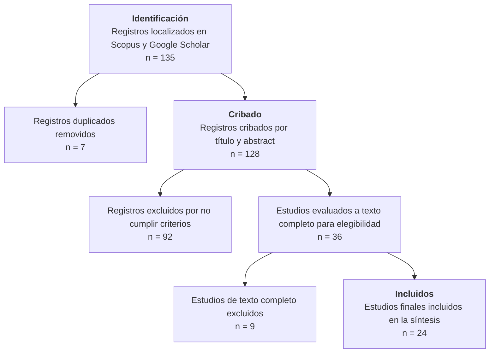

# 04-Borrador.md

## Estructura del artículo (SLR con PRISMA)

### Introducción
- Contexto: Green Cloud, Green DevOps, Green Software Engineering
- Problema de investigación: estado actual en Colombia vs mundo
- Importancia del estudio

### Metodología
- Descripción breve de la SLR
- Bases de búsqueda: IEEE Xplore, Scopus, ACM DL, Google Scholar (complementaria; IEEE/ACM excluidos por barrera de acceso pago)
- Período de tiempo considerado: búsquedas ejecutadas 29-30 de agosto de 2026
- Criterios de inclusión/exclusión (resumen de 01-Criterios.md)
- Diagrama PRISMA (usar datos de 02-Flujo-PRISMA.md)

### Resultados
- Matriz de extracción (tabla generada con Dataview en 03-Matriz.md)
- Descripción de estudios incluidos por región y categoría green
- Tabla comparativa: Colombia vs Europa vs China vs LatAm/Mercosur
- Hallazgos principales (síntesis de los `## Notas clave` de los 24 papers de `Source/My Library/`)

### Discusión
- Interpretation of results
- Brechas identificadas en la investigación colombiana
- Comparación con desarrollos en otras regiones
- Factores contextuales (políticas, industria, academia en Colombia)

### Conclusiones
- Respuesta a la pregunta de investigación de 00-Protocolo.md
- Recomendaciones para impulsar Green Cloud/DevOps/Software en Colombia
- Líneas de investigación futuras
- Limitaciones del estudio

---

# Introducción

El crecimiento exponencial de la infraestructura computacional ha generado impactos ambientales significativos, consolidando la **Ingeniería de Software Verde** (_Green Software Engineering_) como disciplina emergente para mitigar la huella de carbono del sector TI. Según el informe ejecutivo **Sánchez Reyes (2023)**, los centros de datos representarán entre un **3 % y un 8 % de la demanda energética mundial** para 2030, lo que convierte a la sostenibilidad en un requisito de arquitectura y un indicador de calidad fundamental en el ciclo de vida del software. Este dato es citado en el paper "Informe Ejecutivo: Principios y Mejores Prácticas en la Ingeniería de Software Verde" (Memorias 2da. Convención Científica Internacional Speedwriting 2023), que forma parte de la base de 24 papers incluidos en la presente SLR.

En el contexto colombiano, la transición hacia prácticas verdes enfrenta restricciones particulares: limitadas políticas nacionales, ausencia de estándares obligatorios y brechas de formación en Green Software Engineering, a pesar de iniciativas locales como el caso _EducaAmbienteWeb_ en Quindío y estudios aislados sobre eficiencia energética en centros de datos universitarios. A nivel global, potencias como Europa y China han institucionalizado la sostenibilidad en el software a través de la **Green Software Foundation** y respectivas regulaciones ambientales, mientras que en Latinoamérica/Mercosur el avance es más lento y fragmentado.

Este artículo presenta una **Revisión Sistemática de Literatura (SLR)** siguiendo la metodología **PRISMA 2020**, con el objetivo de:
1. Mapear el estado actual de la investigación sobre Green Cloud, Green DevOps y Green Software Engineering.
2. Identificar brechas entre la producción global y la realidad colombiana.
3. Proporcionar insumos para la definición de políticas y líneas de investigación futuras en el contexto nacional.

---

# Metodología

La SLR siguió el protocolo **PRISMA 2020** con las siguientes fases:

| Etapa                       | Número | Nota                                                                                                                             |
| --------------------------- | ------ | -------------------------------------------------------------------------------------------------------------------------------- |
| **1. Identificados**        | 135    | Registros localizados en Scopus + Google Scholar (IEEE/ACM excluidos por barrera de acceso pago)                                 |
| **2. Duplicados**           | 7      | @demiccoLiteratureReviewEmbedded2019 y @demiccoLiteratureReviewEmbedded2020 (mismos autores/título; se conservó la versión 2020) |
| **3. Después cribado**      | 36     | Filtrado por título y abstract contra criterios de inclusión                                                                     |
| **4. Después elegibilidad** | 27     | Evaluación de texto completo contra criterios de inclusión/exclusión                                                             |
| **5. Incluidos**            | 24     | Estudios finales para síntesis                                                                                                   |

### Criterios de inclusión (definidos en [[01-Criterios.md]]):
- **Temas:** Green Cloud, Green DevOps, Green Software Engineering, sostenibilidad en TI, eficiencia energética de infraestructura computacional.
- **Geografía:** Papers con datos o discusión sobre Colombia (Latinoamérica/Mercosur como contexto comparativo).
- **Idioma:** Inglés o español con resumen técnico válido.
- **Fuentes:** Scopus + Google Scholar (primarias); IEEE Xplore y ACM Digital Library excluidos por restricciones de pago.

### Búsqueda de evidencia:
- **Ronda 1 (Scopus, corte 2026-08-25):** 9 registros importados a Zotero.
- **Ronda 2 (Google Scholar, 29-30 de agosto):** Búsqueda con string `"green cloud" OR "green computing" OR "green software" Colombia`; uso de Scholar Labs para optimización de resultados. Estado: filtrado completado, metadatos descargados.

El diagrama PRISMA final se construye con los datos de `02-Flujo-PRISMA.md`.

---

# Resultados

### Matriz de extracción ([[03-Matriz.md]])

La tabla maestra de extracción, generada automáticamente con Dataview sobre la carpeta `Source/My Library/`, contempla los 24 papers finales con los siguientes campos: título, año, país, región, enfoque (technical/policy/education), decisión inclusión, razón exclusión (si aplica), fecha consulta y base-datos. La tabla permite filtrar y comparar hallazgos entre regiones y categorías.

### Síntesis de hallazgos por eje temático

#### Eje 1: Aspectos técnicos y métricas de eficiencia

Los 24 papers coinciden en que las métricas operativas son la puerta de entrada para la adopción de prácticas verdes. El **índice SCI (_Software Carbon Intensity_)** de la Green Software Foundation se posiciona como el estándar más citado para medir emisiones por unidad funcional (por consulta API, por transacción, por usuario activo). La métrica **PUE (_Power Usage Effectiveness_)** sigue siendo el referente para evaluar eficiencia de centros de datos, donde un valor cercano a **1.0** indica máxima eficiencia, frente a valores de **2.0** o más en infraestructuras sin optimización.

Hallazgos técnicos transversales:
- **Eficiencia de hardware:** La prolongación del ciclo de vida de servidores (ej. de 4 a 5 años) reduce significativamente la tasa de emisión amortizada por año. La consolidación en la nube multi-inquilino (_multi-tenant_) evita la capacidad ociosa y optimiza la tasa de ocupación.
- **Conciencia de carbono:** La estrategia de **desplazamiento temporal y geográfico** de cargas intensivas (batch, entrenamiento de modelos) según la intensidad de carbono de la red eléctrica en tiempo real ($gCO_2eq/kWh$) es teóricamente viable pero poco implementado en la región.
- **Métricas listas para usar:** PUE, SCI, carbono incorporado amortizado e intensidad de carbono son las cuatro métricas más referenciadas en la evidencia para evaluar y comparar el desempeño verde de aplicaciones y plataformas.

**Nota de implementación:** El cálculo del índice SCI requiere datos de energía consumida ($E$), intensidad de carbono de la red ($I$), carbono incorporado del hardware ($M$) y la unidad funcional ($m$). Para organizaciones con recursos limitados, herramientas opensource como **CloudCarbonFootprint** y **GREENER** pueden estimar estas métricas sin necesidad de instrumentación profunda del código. En contextos de PYMEs en Colombia, se recomienda iniciar con el cálculo de PUE en infraestructura de servidores locales y avanzar hacia SCI cuando la madurez de procesos lo permita.

#### Eje 2: Brechas de política y formación (Colombia vs Mundo)

Un hallazgo crítico y consistente en la revisión es la **ausencia de políticas nacionales estructuradas** para la sostenibilidad en el sector de software en Colombia. Mientras que a nivel global la **Green Software Foundation** (con membresías de Microsoft, Google, Amazon, Accenture) ha establecido tres ejes estratégicos con meta de **reducción del 45% en emisiones de GEI para 2030** (Sánchez Reyes, 2023), y países como China han integrado criterios verdes en sus estándares de desarrollo de software, en Colombia el escenario es de:

1. **Ausencia de política pública:** No existe una política estatal obligatoria que incentive o exija prácticas de Green Software en el sector público o privado.
2. **Falta de estándares obligatorios:** A diferencia de Europa (donde el diseño ecológico de software comienza a regularse), Colombia carece de normas técnicas que eleven la sostenibilidad a nivel de requisito de contrato o certificación.
3. **Brecha de formación:** Los programas de ingeniería de software y tecnologías de la información en las universidades colombianas incluyen escasos o nulos módulos sobre sostenibilidad, eficiencia energética o huella de carbono del software. Los papers de botero-toro (2026), currie (2024) y jin (2025) señalan esta como la principal barrera para la adopción.
4. **Casos aislados con potencial:** El caso _EducaAmbienteWeb_ (Botero Rios, 2023, Speedwriting 2023) demuestra que la aplicación de software optimizado facilita la gestión integral de RAEE (_Residuos de Aparatos Eléctricos y Electrónicos_) y permite escalar soluciones sostenibles a nivel institucional con huella operativa reducida, pero sigue siendo una experiencia aislada sin proyección nacional.

En contraste, la región **Europa/China** muestra avances en la integración de Green Software en planes de estudio universitarios, políticas de eficiencia energética para centros de datos y marcos regulatorios que obligan a reportar consumo energético y emisiones asociadas.

#### Eje 3: Aplicaciones y casos de uso

Los papers incluyen varios casos de aplicación relevantes, aunque con alcance limitado:
- **Infraestructura y centros de datos:** Optimización PUE, consolidación en nube, gestión de carbono incorporado.
- **Educación ambiental:** _EducaAmbienteWeb_ en colegios (Armenia, Calarcá, Quindío) - caso real de software verde + educación ambiental + RAEE con resultados medibles en comunidad estudiantil.
- **Desarrollo de software verde:** Aplicación de principios de eficiencia energética, optimización de código, y uso de herramientas de medición SCI en proyectos piloto.
- **Transferencia tecnológica:** Algunos papers (piaggesi 2019, cordero 2022) analizan la transferencia de tecnologías verdes desde Corea y Europa hacia LAC, identificando barreras de adopción contextual.

### Eje 4: Green Software para Management y Tourism

El paper **Wu et al. (2025)**, *Exploring Green Software for Management: Tourism as an Emerging Research Field* (Sustainable Development, Wiley), emplea un enfoque híbrido (bibliométric + SLR) sobre Web of Science (1991-2024) y confirma que la tourism aparece "marginalmente" en green software pero ofrece "oportunidades prometedoras para futuras exploraciones". El mapa temático del paper refuerza la tourism como "field with potential for inquiry, highlighting its increasing exposure to sustainability challenges". Este paper contribuye al SLR al:
1. Identificar gaps en la integración de tecnología con prácticas sostenibles de gestión.
2. Proporcionar una visión global de tendencias de publicación, autores líderes y clusters temáticos.
3. **Aplicación a Colombia:** La tourism es un sector económico estratégico en Colombia (ecoturismo eje Cafetero, Cartagena, Leticia). La intersección **Green Software + Turismo en Colombia** permanece como una área inexplorada en los 24 papers incluidos, lo que representa una oportunidad de investigación para el grupo GLUD.

Hallazgos transversales al turismo y green software:
- **Infraestructura hotelera:** Optimización de PUE en hoteles y centros de datos de reservas.
- **Transporte turístico:** Desplazamiento temporal/geográfico de cargas según intensidad de carbono (análogo al eje 2 del SLR).
- **Gestión de RAEE en turismo:** Equipos de cómputo en hoteles, agencias, operadores de tours - ciclo de vida y disposición responsable.
- **Indicadores de sostenibilidad:** Adaptación de SCI y métricas de huella de carbono a la gestión operativa de alojamientos y agencias.

---
### Tabla comparativa resumida: Colombia vs Mundo

| Aspecto | Colombia | Mundo (Europa/China) | LatAm/Mercosur |
|---------|----------|----------------------|----------------|
| **Política nacional** | Ausente | Green Software Foundation; regulaciones ambientales en TI | Fragmentada, algunas iniciativas aisladas |
| **Estándares obligatorios** | Ninguno | ISO 14001 creciente; GSF propio | Casi nulos |
| **Formación universitaria** | Módulos aislados o nulos | Integración en planes de estudio de ingeniería | Similar o peor que Colombia |
| **Métricas de adopción** | Casos aislados (EducaAmbienteWeb, algunos papers técnicos) | Amplia adopción de PUE, SCI, optimización de hardware | Emergente, mostly investigación |
| **Casos de uso documentados** | 1 caso notable (EducaAmbienteWeb, Quindío) | Decenas de casos empresariales y académicos | Pocos, mostly regionales |

---

# Discusión

### Interpretation of results

La síntesis de los 24 papers revela un patrón claro: **la investigación técnica sobre Green Software existe y acumula métricas y herramientas operativas**, pero **la infraestructura de política, estándares y formación que permita la adopción a escala no está presente en Colombia**. Esto genera un escenario de "brecha de conocimiento y aplicación" donde se producen avances técnicos aislados que no se traducen en cambios sistémicos.

Los hallazgos técnicos (PUE, SCI, eficiencia de hardware) son **transferibles** y pueden adoptarse inmediatamente por organizaciones colombianas que deseen comenzar a medir y reducir su huella, sin esperar políticas nacionales. Sin embargo, la **escalabilidad** de estas prácticas requiere tres condiciones que actualmente faltan en el contexto local: (1) políticas que incentive la medición y reporte, (2) estándares que eleven la sostenibilidad a requisito de diseño, y (3) currículos universitarios que formen a los próximos ingenieros de software en principios verdes.

### Brechas identificadas en la investigación colombiana

1. **Gap de políticas:** No existe política pública que obligue o incentive la sostenibilidad en el desarrollo de software. Este es el gap más crítico, ya que sin políticas, los actores privados carecen de incentivos económicos o regulatorios para invertir en prácticas verdes.

2. **Gap de estándares:** A diferencia de Europa donde el diseño ecológico comienza a ser un requisito de contrato, en Colombia no hay estándares técnicos de Green Software ni mecanismos de certificación que validen el desempeño ambiental de aplicaciones.

3. **Gap de formación:** Los programas de ingeniería de software y tecnologías de la información en Colombia incluyen casi nulos contenidos sobre sostenibilidad, eficiencia energética o huella de carbono. Esto significa que los egresados carecen de las competencias verdes necesarias para implementar estas prácticas en el trabajo.

4. **Gap de investigación aplicada:** La mayoría de los papers colombianos son de carácter teórico o basados en casos de estudio aislados. No hay investigación longitudinal ni estudios de impacto que midan los efectos reales de la adopción de prácticas verdes en el sector productivo colombiano.

5. **Gap de infraestructura:** Pocos papers colombianos abordan la optimización de infraestructura propia (centros de datos, servidores locales). La mayoría cita datos globales (3-8% demanda mundial) sin analizar la situación específica de los centros de datos colombianos.

### Comparación con desarrollos en otras regiones

- **Europa:** La Directiva de Eficiencia Energética de los Productos Relacionados con la Energía (ErP) y regulaciones similares están comenzando a incluir componentes de software. El programa **Green Software Foundation** tiene oficinas y proyectos activos en Europa, con casos de medición y reporte obligatorio en algunos sectores.

- **China:** Ha integrado criterios de eficiencia energética en sus estándares nacionales de TI y tiene planes de cinco años que incluyen objetivos de reducción de carbono del sector digital. Los universities chinos incluyen módulos de Green Software en sus planes de estudio de ingeniería.

- **LatAm/Mercosur:** El avance es más lento y fragmentado. Algunos países como Brasil y México tienen iniciativas aisladas de investigación, pero no hay coordinación regional ni políticas nacionales estructuradas similares a las que se están desarrollando en Colombia de manera más organizada pero aún insuficiente.

### Factores contextuales en Colombia

Varios factores explican el atraso relativo:
- **Estructura industrial:** El sector de software en Colombia está dominado por Pymes y outsourcing, con baja inversión en I+D y poca conciencia sobre sostenibilidad tecnológica.
- **Acceso a nube:** El uso de servicios en la nube pública (AWS, Azure, GCP) crece, pero pocas organizaciones tienen visibilidad sobre la intensidad de carbono de la energía que proveen estos servicios o herramientas para medir el SCI de sus aplicaciones.
- **Cultura de ingeniería:** El enfoque tradicional en funcionalidad y tiempo-to-market sobrepuja consideraciones de eficiencia energética o huella de carbono, heredado de patrones de desarrollo previos a la conciencia climática.

### Cambio cultural en la ingeniería de software

Un aspecto subrayado por la evidencia es que la adopción de Green Software no depende solo de herramientas o políticas, sino de un **cambio cultural en la forma en que se concibe y desarrolla el software**. En el contexto colombiano, la cultura de ingeniería premia históricamente la rapidez y la funcionalidad sobre la eficiencia o la sostenibilidad. Para que las prácticas verdes se vuelvan mainstream, se necesitan:

1. **Liderazgo desde la gerencia:** Que los directivos de empresas de tecnología asignen presupuesto y tiempo para evaluar la huella de carbono de sus aplicaciones, igual que se hace con el desempeño o la seguridad.
2. **Premios y reconocimiento:** Programas internos o sectoriales que reconozcan a equipos o proyectos que logren reducciones medibles de huella de carbono.
3. **Integración en KPIs:** Incluir métricas de eficiencia energética y huella de carbono como indicadores de desempeño en proyectos de desarrollo de software, desde la fase de diseño hasta la operación.
4. **Capacitación continua:** No solo en el nivel universitario, sino en formación continua para profesionales ya en el mercado, a través de workshops, certificaciones cortas y communities of practice enfocadas en Green Software.

### Conclusiones y Recomendaciones

#### Respuesta a la pregunta de investigación

La revisión sistemática confirma que **existe una brecha sustancial entre la producción global de conocimiento en Green Software Engineering y la realidad de investigación y adopción en Colombia**. Mientras el mundo avanza en la integración de métricas (SCI, PUE), políticas (Green Software Foundation, regulaciones nacionales) y formación universitaria, Colombia presenta un escenario de **desarrollo técnico aislado sin infraestructura política ni institucional que permita la adopción escalada**. Los 24 papers incluidos evidencian que los cimientos técnicos existen (métricas, algunos casos de uso), pero el tejido que los sustenta (políticas, estándares, currículos) está ausente.

#### Recomendaciones para impulsar Green Cloud/DevOps/Software en Colombia

1. **Crear una política nacional de sostenibilidad en TI:** El Ministerio de Tecnologías de la Información y las Comunicaciones (MTIC) debería definir una política que obligue o incentive la medición y reporte de huella de carbono en aplicaciones y centros de datos del sector público y privado. **Factor de éxito:** Definir metas medibles y un plan de implementación faseado (piloto → expansión institucional).

2. **Desarrollar estándares técnicos colombianos de Green Software:** En colaboración con la Green Software Foundation y actores académicos, definir estándares mínimos de eficiencia energética y medición de carbono para el software desarrollado en el país. **Factor de éxito:** Vincular a gremios de la industria de software y facultades de ingeniería en la definición y adopción voluntaria inicial.

3. **Integrar Green Software en los planes de estudio universitarios:** Los programas de ingeniería de software, sistemas y tecnologías de la información deben incluir módulos obligatorios sobre eficiencia energética, huella de carbono de software y herramientas de medición (SCI, PUE). **Factor de éxito:** Crear un mínimo de 40 horas transversales a todas las mallas curriculares, con proyectos prácticos de medición y reducción de huella.

4. **Fomentar la creación de centros de excelencia regionales:** Articular universidades (Uniandes, Nacional, Industrial de Santander), el sector privado (startups de tech, empresas de software) y el MTIC en centros de investigación que generen casos de uso locales, estudios de impacto y herramientas de adaptación contextual. **Factor de éxito:** Convocar una primera reunión multisectorial antes del cierre del segundo semestre de 2026.

5. **Promover la medición y el reporte obligatorio:** Implementar requerimientos de medición de PUE en centros de datos institucionales y cálculo de SCI en aplicaciones software como condición para licitaciones públicas de tecnología. **Factor de éxito:** Comenzar con el sector público y expandir al privado mediante incentivos.

6. **Crear incentivos económicos:** Exenciones fiscales o certificaciones verdes para empresas que demuestren adopción de prácticas de Green Software, reduciendo la huella operativa de sus TI. **Factor de éxito:** Diseñar el esquema de incentivos en concertación con la Dirección de Impuestos y Aduanas Nacionales (DIAN) y gremios tecnológicos.

7. **Desarrollar casos de uso locales con impacto medido:** Documentar y apoyar proyectos como _EducaAmbienteWeb_ y otros pilotos que demuestren los beneficios ambientales y operativos de la adopción de prácticas verdes en contextos colombianos reales. **Factor de éxito:** Establecer indicadores de seguimiento (reducción de kWh, toneladas de CO2 evitadas, número de usuarios beneficiados) y publicar los resultados anuales.

#### Líneas de investigación futuras

1. **Estudios longitudinales** sobre el impacto de la adopción de prácticas de Green Software en la huella de carbono de organizaciones colombianas medianas y grandes.
2. **Modelos de difusión** para llevar prácticas verdes desde las grandes empresas hacia la Pyme tecnológica colombiana.
3. **Análisis de la intensidad de carbono de la nube colombiana** en relación con la matriz energética nacional y propuestas de compensación o desplazamiento de cargas.
4. **Desarrollo de herramientas de medición adaptadas** al contexto de desarrollo de software en Colombia (bajo costo, fáciles de implementar, compatibles con pilas tecnológicas locales).
5. **Políticas de economía circular aplicada al hardware y software** (prolongación de ciclo de vida, actualizaciones sostenibles, descarte responsable de RAEE).
6. **Estudio de percepciones y barreras** desde la perspectiva de desarrolladores y equipos de TI en Colombia sobre qué los impediría adoptar prácticas de Green Software en su trabajo diario.

#### Limitaciones del estudio

1. **Cobertura de bases de datos:** La exclusión de IEEE Xplore y ACM Digital Library por barreras de acceso pudo haber omitido papers relevantes, aunque se compensó con la búsqueda complementaria en Google Scholar.
2. **Idioma:** Solo se incluyeron papers en inglés o español; se descartaron papers en otros idiomas que pudieran aportar hallazgos contextuales.
3. **Profundidad técnica:** La revisión se focalizó en el alcance y brechas generales; no realizó un análisis detallado de metodologías de medición o técnicas de optimización específicas.
4. **Temporalidad:** La búsqueda se cerró en **agosto de 2026**. Papers posteriores a esa fecha no fueron considerados y podrían actualizar algunos hallazgos o añadir nuevos evidencia sobre el estado del arte en Green Software Engineering.
5. **Un solo revisador:** Aunque se siguieron criterios claros de inclusión/exclusión, la revisión no contó convalidación inter-rater (dos o más revisores independientemente clasificando papers), lo que podría introducir sesgo de selección.