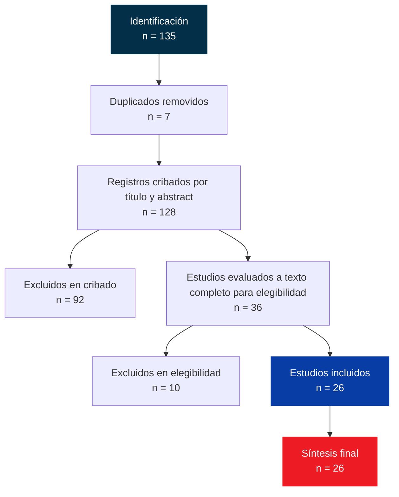

# Green Software Engineering en Colombia

### Revisión Sistemática de Literatura (SLR) con Metodología PRISMA 2020

<div align="center">


*"El software sostenible no es una opción, es una necesidad para el futuro del sector TI en Latinoamérica."*

</div>

---

## Resumen Ejecutivo

Esta revisión sistemática de literatura analiza el estado actual de **Green Cloud, Green DevOps y Green Software Engineering** en Colombia, comparándolo con Europa, China y otros países de Latinoamérica. Utilizando la metodología **PRISMA 2020**, el estudio identifica brechas críticas en políticas públicas, formación universitaria y estándares técnicos que limitan la adopción de prácticas sostenibles en el sector de software colombiano.

### Hallazgos Clave

| Dimensión | Colombia | Europa/China | LatAm/Mercosur |
|-----------|----------|--------------|----------------|
| **Políticas públicas** | Ausentes | Green Software Foundation; regulaciones activas | Fragmentadas |
| **Estándares técnicos** | Ninguno | ISO 14001; certificaciones GSF | Casi nulos |
| **Formación universitaria** | Módulos aislados | Integración curricular | Similar o inferior |
| **Métricas de adopción** | Casos aislados | PUE, SCI ampliamente adoptados | Emergente |
| **Casos documentados** | 1 caso notable | Decenas de casos empresariales | Pocos, regionales |

---

## Pregunta de Investigación

> ¿Cuál es el estado actual de las políticas y desarrollos en Green Cloud, Green DevOps y Green Software Engineering en Colombia, comparado con Europa, China y otros países de Latinoamérica?

---

## Metodología

### Diseño del Estudio

- **Tipo:** Revisión Sistemática de Literatura (SLR)
- **Metodología:** PRISMA 2020 (Preferred Reporting Items for Systematic Reviews and Meta-Analyses)
- **Período de búsqueda:** Agosto 2026
- **Bases de datos:** Scopus, Google Scholar
- **Idiomas:** Inglés, Español

### Flujo PRISMA



### Criterios de Búsqueda

**Strings de búsqueda:**
```
("green cloud" OR "green computing" OR "green software engineering" OR "green devops") 
AND ("Colombia" OR "Latin America")
```

**Fuentes excluidas:** ACM Digital Library (barreras de acceso pago). IEEE Xplore ahora incluido gracias al acceso institucional de la universidad.

---

## Brechas Críticas Identificadas

### 1. Gap de Políticas
No existe política pública que obligue o incentive la sostenibilidad en el desarrollo de software. Este es el gap más crítico, ya que sin políticas, los actores privados carecen de incentivos económicos o regulatorios para invertir en prácticas verdes.

### 2. Gap de Estándares
A diferencia de Europa donde el diseño ecológico comienza a ser un requisito de contrato, en Colombia no hay estándares técnicos de Green Software ni mecanismos de certificación que validen el desempeño ambiental de aplicaciones.

### 3. Gap de Formación
Los programas de ingeniería de software y tecnologías de la información en Colombia incluyen casi nulos contenidos sobre sostenibilidad, eficiencia energética o huella de carbono. Los egresados carecen de competencias verdes necesarias.

### 4. Gap de Investigación Aplicada
La mayoría de los papers colombianos son de carácter teórico o basados en casos de estudio aislados. No hay investigación longitudinal ni estudios de impacto que midan efectos reales de adopción.

### 5. Gap de Infraestructura
Pocos papers abordan la optimización de infraestructura propia (centros de datos, servidores locales). La mayoría cita datos globales sin analizar la situación específica colombiana.

---

## Recomendaciones Estratégicas

### 7 Prioridades para Colombia

| # | Recomendación | Acción Específica |
|---|---------------|-------------------|
| 1 | **Política nacional de sostenibilidad en TI** | MTIC debe definir política que obligue medición y reporte de huella de carbono |
| 2 | **Estándares técnicos colombianos** | Colaboración con Green Software Foundation y actores académicos |
| 3 | **Integrar Green Software en universidades** | Mínimo 40 horas transversales a mallas curriculares |
| 4 | **Centros de excelencia regionales** | Articular universidades, sector privado y MTIC |
| 5 | **Medición y reporte obligatorio** | PUE en centros de datos, SCI en aplicaciones |
| 6 | **Incentivos económicos** | Exenciones fiscales o certificaciones verdes |
| 7 | **Casos de uso locales documentados** | Proyectos como EducaAmbienteWeb con impacto medido |

---

## Oportunidades de Investigación

- **Green Software + Turismo:** Sector estratégico colombiano (ecoturismo eje Cafetero, Cartagena, Leticia) con poca investigación
- **Modelos de difusión:** Llevar prácticas verdes desde grandes empresas hacia PyMEs tecnológicas
- **Intensidad de carbono de la nube colombiana:** Análisis en relación con la matriz energética nacional
- **Herramientas de medición adaptadas:** Bajo costo, fáciles de implementar, compatibles con pilas tecnológicas locales

---

## Estructura del Repositorio

```
/
├── README.md                    ← Este archivo
├── 00-Protocolo.md              Pregunta de investigación, objetivo, alcance
├── 01-Criterios.md              Criterios de inclusión/exclusión + queries
├── 02-Flujo-PRISMA.md           Contadores PRISMA (auto-generado)
├── 03-Matriz.md                 Tabla Dataview (auto-generada)
├── 04-Borrador.md               Artículo: Intro, Método, Resultados, Discusión
├── Reunion-1-09.md              Notas de reunión del 1 de septiembre
├── referencias.bib              BibTeX (Zotero + Better BibTeX)
├── scripts/
│   └── update_prisma.py         ← Automatización PRISMA
└── Source/
    └── My Library/              Papers leídos con plantilla
```

---

## Automatización

### Script de Actualización PRISMA

Ejecuta el siguiente comando para actualizar automáticamente los contadores:

```bash
python3 scripts/update_prisma.py
```

**Qué hace:**
- Lee todos los papers en `Source/My Library/`
- Filtra los que tienen campos `pais`, `region`, `enfoque` en frontmatter
- Actualiza `02-Flujo-PRISMA.md` con los contadores correctos
- Actualiza `03-Matriz.md` con código Dataview optimizado
- Muestra resumen de papers incluidos/excluidos

**Campos requeridos en frontmatter:**
```yaml
---
pais: Colombia      # o Global, etc.
region: LAC         # o Europa, China, etc.
enfoque: policy     # o technical, education, management
---
```

---

## Tecnologías y Herramientas

| Herramienta | Uso |
|-------------|-----|
| **Obsidian** | Editor de markdown y gestión de conocimiento |
| **Dataview** | Generación automática de tablas |
| **Zotero + Better BibTeX** | Gestión de referencias y exportación BibTeX |
| **PRISMA 2020** | Metodología de revisión sistemática |
| **Python 3** | Scripts de automatización |

---

## Limitaciones del Estudio

1. **Cobertura de bases de datos:** Exclusión de IEEE Xplore y ACM Digital Library pudo omitir papers relevantes
2. **Idioma:** Solo papers en inglés o español
3. **Temporalidad:** Búsqueda cerrada en agosto de 2026
4. **Un solo revisador:** Posible sesgo de selección (sin validación inter-rater)
5. **Profundidad técnica:** Focalizado en alcance y brechas generales, no en metodologías específicas

---

## Contacto y Referencias

**Protocolo fuente:** [Sánchez Reyes (2023)](https://sol.sbc.org.br/index.php/sbsi/article/view/41319) - "Principios y Mejores Prácticas en la Ingeniería de Software Verde"

**Base de evidencia:** 26 papers incluidos en la revisión sistemática, cubriendo período 2009-2026

---

<div align="center">

**Proyecto de Revisión Sistemática** | Universidad Nacional de Colombia  
*Última actualización: Septiembre 2026*

</div>